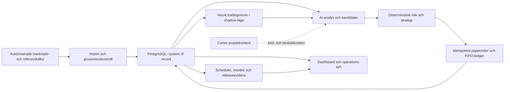

# Systemöversikt

Trading Agent är uppdelad efter ansvar och bevisgräns. AI får analysera och
föreslå, men datakvalitet, risk, orderbokföring och aktivering avgörs av
deterministisk kod.

## Ansvarsområden

| Område | Huvudfiler | Ansvar |
| --- | --- | --- |
| Agentkärna | `agent/src/core/` | analys, kandidater, strategi, risk och papertrader |
| Data | `agent/src/data/` | providergränser, referensdata, orderbok och databasåtkomst |
| Schemaläggning | `agent/src/main.py`, `agent/src/core/schedule.py` | rutiner, durable leases och återstart |
| Ledger | `agent/src/data/database.py`, `db/` | transaktioner, FIFO-lots, migrationer och append-only evidens |
| Lärande | `agent/src/core/continuous_learning.py`, workers | prediction/outcome-journal och kontrollerad strategiutvärdering |
| Grafminne | `agent/src/knowledge_*`, `docs/trading-knowledge-graph.md` | härledda samband och isolerad shadow-jämförelse |
| Dashboard | `dashboard/` | operatörsvy, readiness, blockers och revisionskedjor |
| Drift | `ops/release/`, `.github/workflows/` | immutable release, schema-gate, rollback och CI |

## Beständiga datagränser

### PostgreSQL

Bindande källa för ledger, portfölj, strategi, riskkontroller, providerbevis,
schemarutiner, larm och benchmarkutfall. Skrivningar som påverkar kapital-
eller beslutskedjan ska vara transaktionella och idempotenta.

### Neo4j

Härlett tradingminne för samband mellan instrument, beslut, kandidater,
utfall och strategiversioner. Grafminnet är shadow-only tills en separat,
operatörsgodkänd aktivering finns. Ett graf- eller synkfel får inte fabricera
evidens eller kringgå PostgreSQL.

### Cortex

Repoindex för kod, regler, ADR:er och påverkan. Cortex ska sökas före större
kodbeslut och uppdateras efter bestående ändringar. Det är projektkontext,
inte runtime-ledger.

### Objektlagring

Speglar redan validerade, checksummebundna råfiler. Arkivfel är synliga men
får inte skriva om den bindande databashistoriken.

## Icke förhandlingsbara invarianter

- Ingen brokerkoppling eller handel med riktiga pengar utan separat beslut.
- Ingen order utan auktoriserad och tillräckligt färsk marknadsdata.
- Ingen AI-utdata får kringgå deterministisk risk eller operatörens nödstopp.
- Varje paperorder ska kunna följas tillbaka till data, strategi och beslut.
- Migrationer körs framåt, exakt en gång och före applikationsstart.
- Secrets kommer från låsta runtime-filer eller secret manager, aldrig Git,
  Neo4j, Cortex eller `.env` i dokumentation.
- Deployment ska kunna kopplas till grön CI, Git-revision och immutable
  image-digest.

## Fördjupning

- [Aktuellt läge](CURRENT_STATE.md)
- [Arbetsströmmar](WORKSTREAMS.md)
- [Drift och releaser](operations.md)
- [Trading knowledge graph](trading-knowledge-graph.md)
- [Beslut om marknadsdatagräns](decisions/ADR-001-authorized-market-data-boundary.md)

